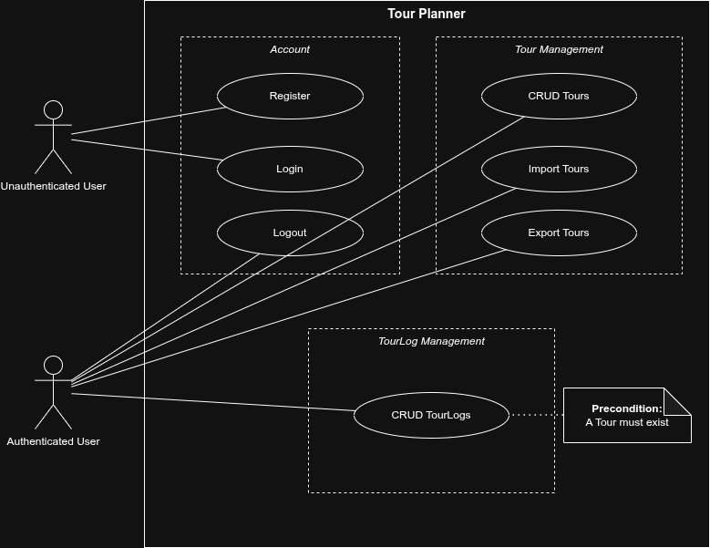
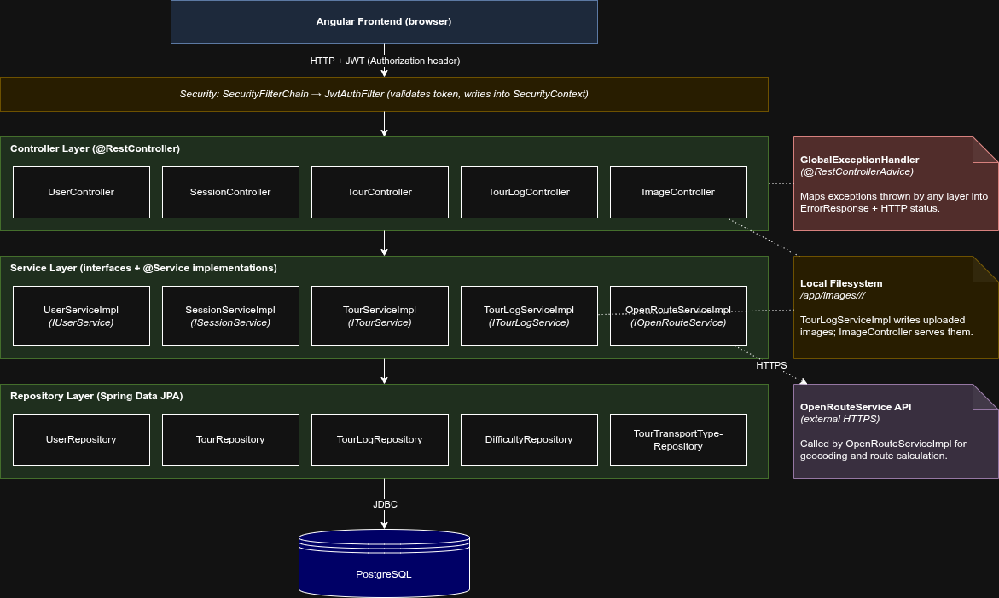
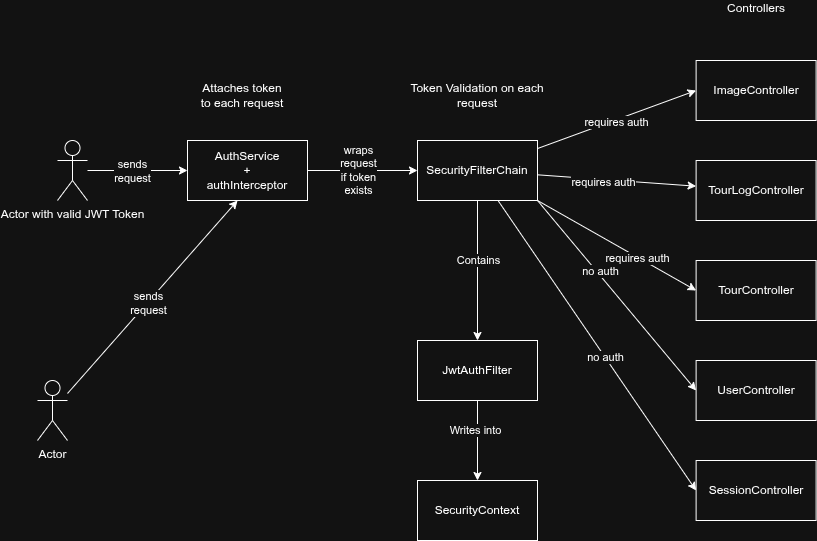

# Tour Planner

A web app for planning bike, hike, running and vacation tours - and keeping a log of every time you actually go and do them.
Built as the SWEN 2 semester project at FH Technikum Wien, Summer 2026.

**Authors:** Abris Mezo, Adrian Strassnig

---

## What it does

The point of the app isn't really the tour itself, it's the **TourLog**.
A Tour is just the recipe (start, end, transport, computed distance and time).
The interesting part is building up a personal history of every time you actually went and did one of your tours.

What you can do:

- Plan a route between two addresses, pick a transport type (bike / hike / car / etc.) and let OpenRouteService figure out the distance and estimated time for you.
- Save it as a **Tour** so you can come back to it later.
- Add **TourLogs** every time you actually go and do the tour - date, your time, difficulty rating, comments, and a photo from the trip.
- Search across all your tours with a multi-field filter (start, end, transport) plus a free-text query that also looks inside log comments and ratings.
- Import or export your tours as JSON so you can back them up or share them with a friend.
- Stay logged in via a stateless JWT auth flow (no session storage on the backend).

## Stack

- **Backend**: Java 21 + Spring Boot 4 (REST, Spring Data JPA / Hibernate, Spring Security with JWT)
- **Frontend**: Angular 21 (standalone components, modern `@if` / `@for` control flow, signals, zoneless change detection)
- **Database**: PostgreSQL 17
- **Maps**: Leaflet + the OpenRouteService Directions API
- **Logging**: Log4j 2 (console + daily rolling file, gzipped, 30 day retention)
- **Tests**: JUnit 5 + Mockito + AssertJ on the backend

## Architecture

### Use case diagram

Who can do what.
The unauthenticated user only gets to register and log in - everything else (CRUD tours, CRUD logs, import / export, logout) is behind the auth wall.



### Layered architecture

How the backend layers fit together.
Controllers stay thin and just delegate, services hold the actual logic and are injected via interfaces, repositories use Spring Data JPA on top of PostgreSQL.
The right column shows the cross-cutting bits: the `GlobalExceptionHandler`, the local filesystem for uploaded images, and OpenRouteService as the one external dependency.



### Authentication flow

What happens to a request between leaving the browser and reaching a controller - the Angular interceptor attaches the JWT, Spring Security validates it, and only then does the request hit the actual endpoint.



## Repository layout

```
backend/              Spring Boot app (Maven, ./mvnw)
ui/                   Angular app (npm)
db/                   Postgres init.sql
documentation/        Spec PDF, protocols, checklists, UML diagrams
docker-compose.yml    Brings up Postgres + backend together
.env.example          Template for the env vars you need to set
```

## Running it locally

### Prerequisites

- JDK 21
- Node 20+ / npm
- Docker (only if you want the one-shot docker-compose path)
- A free OpenRouteService API key from https://openrouteservice.org/

### 1. Set up env vars

```bash
cp .env.example .env
# then open .env and fill in JWT_SECRET and OPENROUTESERVICE_APIKEY
```

### 2. Start the backend + database

The easy path: docker-compose brings up Postgres and the backend in one shot, and reads `.env` for you.

```bash
docker-compose up --build
```

The backend listens on http://localhost:8080.

### 3. Start the frontend

```bash
cd ui
npm install
npm start
```

The frontend listens on http://localhost:4200 and talks to the backend on `:8080`.

## Running the tests

Backend (JUnit 5 + Mockito):

```bash
cd backend
./mvnw test
```

Frontend (Karma + Jasmine):

```bash
cd ui
npm test
```

## Documentation

Everything lives in the `documentation/` folder:

- `semester-project.pdf` - the original assignment
- `SWEN2_Intermediate_Protocol.pdf` - the intermediate submission
- `TourPlanner_Checklist_Final.xlsx` - grading checklist
- `UseCaseDiagram.drawio` - use case diagram (source)
- `LayeredArchitecture.drawio` - backend layered architecture (source)
- `SequenceDiagram_FullTextSearch.drawio` - search flow sequence diagram (source)
- `auth_architecture_drawio.png` - authentication flow diagram (PNG only)

---

Built for the SWEN 2 course at FH Technikum Wien.
